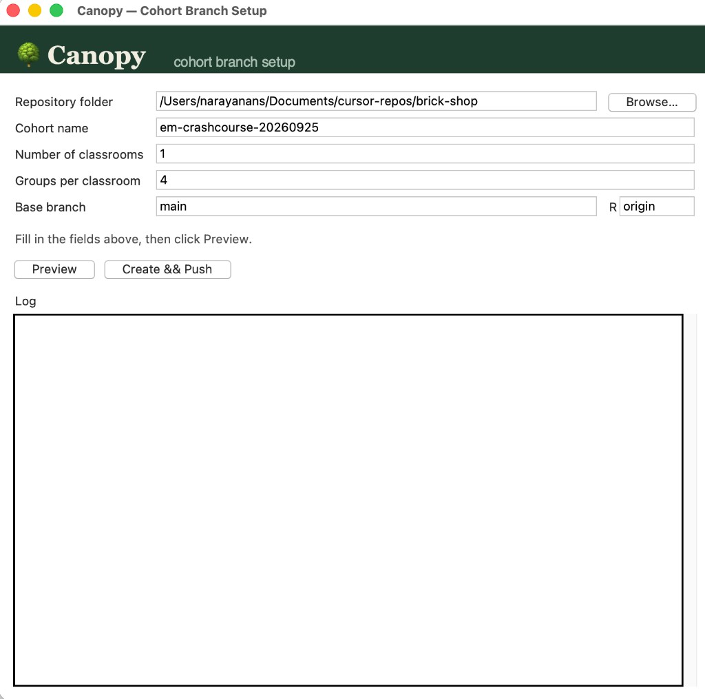

# 🌳 Canopy

Canopy creates the git branches for a cohort: one set for the groups, plus an instructor branch. You fill in a form and click a button. No browser, and no git commands to type.

## Download and open it

Get the app that matches your computer, then double-click it. You do not need Python, Cursor, or VS Code.

- **Mac:** download [Canopy.app](downloads/Canopy.app) and double-click it.
- **Windows:** download [Canopy.exe](downloads/Canopy.exe) and double-click it.

Git has to be installed on that computer, and you need to already be able to push to the repository. Canopy does not ask for a password. It pushes as you.

## How to use it

The window opens with one classroom and four groups. Work down the form, preview the names, then create them.



1. **Repository folder.** Choose the local copy of the repo these branches belong to. Use **Browse…** if you do not want to type the path. This folder decides which repo gets the branches.
2. **Cohort name.** This starts empty. What you type becomes the start of every branch name. Examples: `em-crashcourse-yyyymmdd` or `aisdlc-bc-yyyymmdd`.
3. **How many classrooms?** This starts at **1**. Leave it at 1 when everyone is in a single classroom. Raise it when several classrooms run in parallel on the same day. A note under the field tells you that `classroom-01`, `classroom-02`, and so on will be added to the branch name.
4. **How many groups?** This starts at **4**. With more than one classroom, each classroom gets its own row, because they do not have to have the same number of groups.
5. **Base branch.** The branch the new ones are copied from. Usually `main`.
6. **The switch under Base branch.** Leave it off. Turn it on only if the remote is not called `origin`, then type that remote's name.
7. Click **Preview**. The log lists every branch. Nothing is created or pushed.
8. If the list looks right, click **Create && Push** and confirm. The log shows each branch as it goes. Branches that already exist are skipped.

With one classroom, the names look like this:

```
em-crashcourse-20260929/groupa
em-crashcourse-20260929/groupb
em-crashcourse-20260929/groupc
em-crashcourse-20260929/groupd
em-crashcourse-20260929/instructor
```

With two classrooms on the same day, each classroom gets its own groups and its own instructor. In this example classroom 1 has three groups and classroom 2 has one:

```
em-crashcourse-20260929/classroom-01/groupa
em-crashcourse-20260929/classroom-01/groupb
em-crashcourse-20260929/classroom-01/groupc
em-crashcourse-20260929/classroom-01/instructor
em-crashcourse-20260929/classroom-02/groupa
em-crashcourse-20260929/classroom-02/instructor
```

## Running it again

If you need more branches later, open Canopy again, raise **How many classrooms?** or the group count for a classroom, and click **Create && Push**. Anything that already exists is skipped. Nothing is overwritten or deleted.

## If something goes wrong

- **"not a git repository"** means the Repository folder is not a git clone. It needs a `.git` folder.
- **"Base branch not found"** means that branch name is missing. Check the spelling, or run `git fetch` in that folder first.
- **Every push fails** usually means git on this computer cannot push to that repo yet. From that same folder, try `git push origin main` in a terminal.
- **Branches landed in the wrong repo** means the Repository folder points somewhere else. In that folder, `git remote -v` shows the repo it will push to.

## For the geeks

### Run it from source

You need Python 3 with tkinter, and git on your PATH.

```bash
python canopy.py
```

or

```bash
python3 canopy.py
```

On Linux, a missing tkinter usually means installing it first, for example `sudo apt install python3-tk` on Debian or Ubuntu.

### Build the click-and-run app

Build on the kind of computer the app will run on. A Mac build makes `Canopy.app`. A Windows build makes `Canopy.exe`. Python is only needed on the machine that builds it. The computer that opens the app still needs git.

**Mac**

```bash
python3 -m pip install pyinstaller
python3 -m PyInstaller --windowed --name Canopy canopy.py
```

That writes `dist/Canopy.app`. If the build says `No module named '_tkinter'` and Python came from Homebrew, install the matching Tk package first (for example `brew install python-tk@3.14`) and run the commands again.

**Windows**

```bash
py -m pip install pyinstaller
py -m PyInstaller --windowed --onefile --name Canopy canopy.py
```

That writes `dist\Canopy.exe`. If the build fails while importing tkinter, reinstall Python from python.org and leave the tcl/tk option enabled.

### What the push actually does

Canopy creates each missing branch locally from the base branch, then pushes them 100 at a time. Branches that already exist locally or on the remote are left alone. A single classroom omits the `classroom-01` segment. Two or more classrooms each get that segment, their own group letters (`groupa`, `groupb`, …), and their own `instructor` branch.
